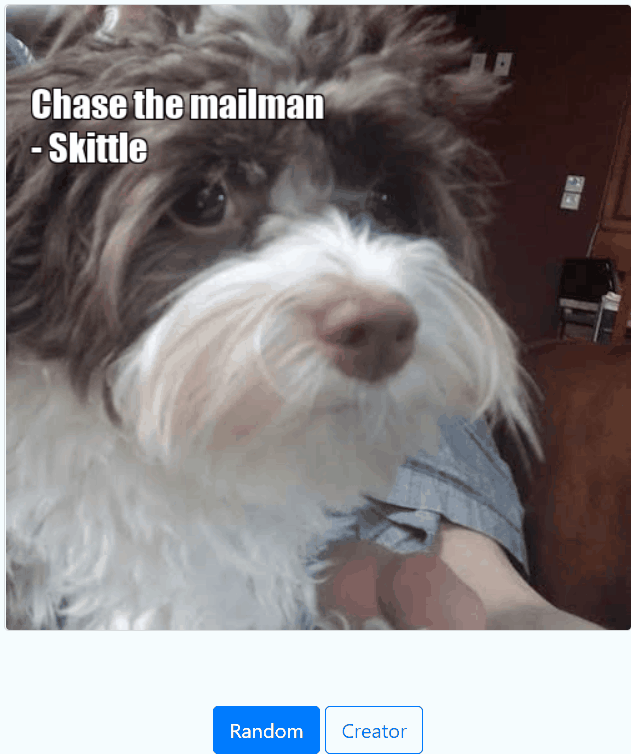

# Meme Generator

Web application provides functionality to generate random meme and also has an option to create custom meme.

## Instructions for setup and running project

1) Install dependencies:<br>
   Easier way - <code>make venv</code>.<br>
   Harder way - replicate what is done in the Makefile(install python, virtual environment and dependencies from
   requirements.txt).<br>
2) To parse pdf this project uses [Xpdf library](https://www.xpdfreader.com/download.html)

   Xpdf may not be installed on your local machine. If this is the case, you can install it using the open source
   [XpdfReader utility](https://www.xpdfreader.com/pdftotext-man.html). Here are some tips for installing xpdf on
   different operating systems:

   - For **Mac**, we suggest that you use Homebrew:
       - If you don't already have it, install [use the command provided here to install Homebrew](https://brew.sh/). After
         installing, read the last few lines that it outputs in your CLI—it may provide additional commands that you can
         run to add Homebrew to PATH.
       - Once Homebrew is installed, simply run <code>brew install xpdf</code> in the terminal.
   - For **Windows**, you'll need to:
       - [Download the Windows command-line tools from the xpdf website.](https://www.xpdfreader.com/download.html)
       - Unzip the files in a location of your choice.
       - Get the full file path to the folder named bin32 (if you have a 32-bit machine) or bin64 (if you have a 64-bit
         machine).
       - Add this path to the Path environment variable. This will allow you to use the xpdf command from the command line.
         If
         you've never done this before, check out this Stack Overflow post on how to add a folder to the Path environment
         variable.
   - For **Linux**, you can use Homebrew (as shown above for Mac) or apt-get to install (simply enter <code>sudo apt-get
     install -y
     xpdf</code> in your command line interface).

3) How to run:

- as a cmd application

```bash
$ cd src
$ python meme.py -h
usage: meme.py [-h] [--path PATH] [--body BODY] [--author AUTHOR]

Generate a motivational meme. The script returns a path to a generated image.
If any argument is not defined, a random selection is used.

options:
  -h, --help       show this help message and exit
  --path PATH      path to an image file
  --body BODY      quote body to add to the image
  --author AUTHOR  quote author to add to the image
```

- as a web application:

```bash
$ cd src
$ python app.py
```

or

```bash
make app
```

## Modules
- meme_engine - responsible for creating memes.<br>
  Example of usage:

```python
# Create class with output folder which is used to save transformed images
meme_engine = MemeEngine(OUTPUT_FOLDER_PATH)
# Create meme using image, quote body and author
path = meme_engine.make_meme(img, quote.body, quote.author)
```

- quote_engine - responsible for parsing/ingesting quotes.<br>
  Example of usage:

```python
 Ingestor.parse(quotes_file_path)
```


Extension:

1) Make it Unique. Add your own content (images and quotes).
2) Unit test everything. Define unit tests to ensure your code functions as intended.
3) Deploy as a Webapp. Deploy the flask server to Heroku so that it can be accessed publicly.
4) Extend your system. Be creative by using your meme generator in unique ways – ideas include:
5) Sharing the generated image with an email
6) Using a 3rd party API to dynamically add more information. You can check out a bunch of 3rd party APIs here. Some
   possibilities are:
   Weather, traffic, locations
7) Use Amazon Rekognition to identify the image content and define rules to choose the quote category